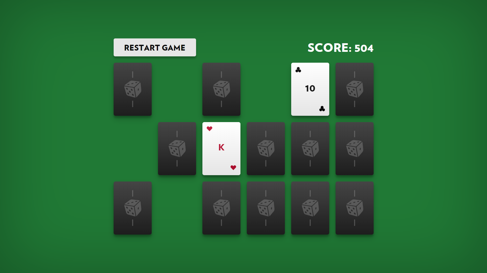

# Memory Game

React-приложение “Memory Game”.

## Задача

Реализовать веб-интерфейс и клиентскую логику карточной игры «Memory» в соответствии с предложенными правилами и дизайном.

### Правила игры

«Memory» – это карточная настольная игра для одного игрока. Игрок открывает любые две карты за один ход. Если при открытии образовалась пара одинаковых по масти и рангу карт, то они удаляются со стола, и игроку начисляются очки. Если открытые карты оказались разными, то они переворачиваются обратно рубашкой вверх, а количество набранных очков уменьшается.

Очки пересчитываются на каждом ходу по следующему принципу:

- при образовании пары прибавляется число нераскрытых пар, умноженное на 42;
- при несовпадении пары вычитается число раскрытых пар, умноженное на 42.

## Требования к выполнению задачи

1. Задача должна быть решена с использованием следующих технологий: HTML, CSS, React, TypeScript.
2. Код приложения должен содержать необходимые комментарии.
3. Требуется обеспечить корректную работу приложения во всех современных браузерах.
4. Вывод графики должен быть реализован средствами CSS и TypeScript, допускается минимальное использование растровых картинок.
5. Интерфейс должен быть приятен глазу и вызывать желание играть снова и снова.
6. Игра должна выглядеть законченным продуктом, целостно.

## Теги

React, TypeScript, HTML, CSS, CSS-in-JS, Emotion, анимации, алгоритмы и структуры данных, ESLint, Prettier

## Screenshots

## Demo

Рабочая версия приложения развернута на github.io

**[Запустить демо!](https://nshaikhinurov.github.io/memory-game/)**

## Автор

**Наиль Шайхинуров**

Telegram: [@nshaikhinurov](https://t.me/nshaikhinurov), email: n.shaikhinurov@gmail.com
